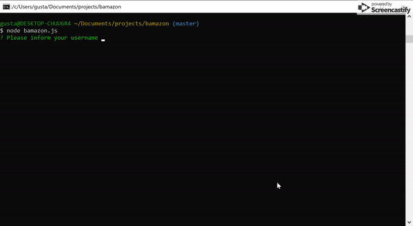
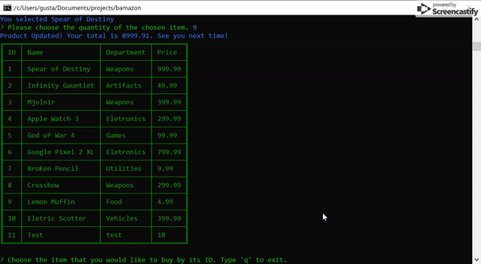

# Bamazon - Built with Node.js, Javascript and MySQL 



I'm a big fan of Amazon, so this is a simple version of it, with three user levels: Guest, Manager and Supervisor, each one of them with different roles and options. Enjoy! 

## Getting Started :floppy_disk:

### Prerequisites :open_file_folder:
Make sure you have node.js installed on your computer! You can download it via the installer on the official site
```
https://nodejs.org/en/download/
```
Then either clone or download this repo.

This application is also using MySQL for data storage and viewing. It's necessary that you install MySQL on your computer.
```
https://dev.mysql.com/downloads/windows/installer/8.0.html
```

It is also recommended that you install a software like MySQL Workbench or HeidiSQL to manage your new database. Then import the following file to your software:

[Schema + Seeds](./schema-seeds.sql)

### Installation :file_folder:
Inside your terminal or command prompt, navigate to the location of the cloned repo. Install the necessary dependencies by running - 
```
npm i
```

## Using the App :computer:


Type `node bamazon.js` into your terminal to begin using the app. You can navigate through the commands using the up and down arrows and hitting enter. 

To exit the app either hold down `control + c`

## Guest :computer:


username: guest
password: guest

Guests are able to buy products and see the list of available products for sale. Also, if the chosen product has a stock quantity less than the quantity the guest wants, he/she will be informed about this information.


## Manager :computer:



username: manager
password: manager

Managers can check the product list with all the details, such as stock. They also can see all the products that have a stock less than 5. Finally, a manager can add a new product to the store.


## Supervisor :computer:

username: supervisor
password: supervisor

Supervisors can have a report of all the product sales by department, joining the Product and Department tables. Also, supervisors can create new departments.


## Built With :cd:
* [Javascript](https://www.javascript.com/) - programming language
* [Node.js](https://nodejs.org/en/) - javascript runtime
* [MySQL](https://dev.mysql.com/downloads/windows/installer/8.0.html) - Database Language

### NPM Packages
* [table](https://www.npmjs.com/package/table)
* [chalk](https://www.npmjs.com/package/chalk)
* [inquirer](https://www.npmjs.com/package/inquirer)
* [mysql](https://www.npmjs.com/package/mysql)
* [md5](https://www.npmjs.com/package/md5)

## Author :key:
* **Gustavo Gibo** - [gustavogibo](https://github.com/gustavogibo)